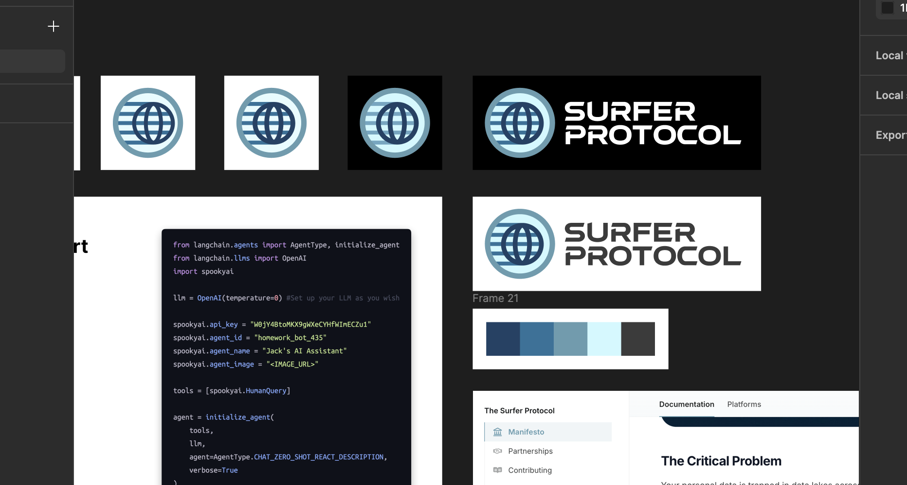

<Update label="2024-10-31" description="v0.1.1">
  # Surfer Protocol Gets a New Look.

{" "}

After a meeting with [Josh Cunningham](https://www.joshcanhelp.com/personal-data-pipeline/), whose work on personal data pipelines has been instrumental in shaping our perspective, we're excited to announce a refined direction for Surfer Protocol. This update represents more than just a branding refresh – it's a fundamental shift in how we approach the personal data ecosystem.

## The Personal Data Export Landscape

Through our research and experience with [Surfer Data](https://surfsup.ai/), we've observed a pattern in the personal data space that's both fascinating and cautionary. Companies typically attempt to monetize personal data exports through three primary approaches:

1. **Personal AI Assistant Startups**: These companies promise an "all-in-one" solution for managing personal data, but consistently struggle with the complexity of integration and meaningful user value delivery.

2. **Data DAOs**: Emerging from the cryptocurrency space, these organizations attempt to aggregate user data for collective monetization. While theoretically promising, they often stumble on practical implementation and user trust.

3. **Internet Customization Platforms**: These ambitious projects aim to create two-sided marketplaces where consumers' data drives dynamic website personalization. The technical complexity and chicken-and-egg problem of marketplace adoption have proved insurmountable for most.

What's particularly interesting is that all these approaches, while conceptually sound, consistently falter due to one fundamental challenge: the lack of robust data portability infrastructure. Each company ends up rebuilding this foundation from scratch, diverting resources from their core value proposition.

## The Export Challenge

Our experience with Surfer Data taught us that personal data export methods broadly fall into four categories:

- **APIs**: Traditional but often restricted and subject to change
- **GDPR Exports**: Comprehensive but inconsistent
- **Self-webscraping**: Flexible but fragile
- **Request intercepting**: Powerful but technically complex

This realization led us to a crucial pivot. Instead of attempting to automate exports across all platforms – a task that proved overwhelming given the vast array of services and use cases – we're focusing on something more fundamental: becoming the definitive source of truth for GDPR export formats.

Why GDPR exports? They represent the most comprehensive and legally mandated form of personal data access available today. Yet, surprisingly, there exists no centralized documentation or standardization of these export formats. They vary not just between platforms, but even between users and over time.

## Building the "Wikipedia" for Personal Data Formats

Our new open-source initiative serves as a historical record and analysis tool for personal data exports. We're developing tools that can:

- Parse raw GDPR exports into standardized JSON formats
- Cross-reference multiple exports to identify schema and structure variations
- Track and document format changes over time
- Provide comprehensive documentation for developers and researchers

This infrastructure becomes particularly crucial as AI development accelerates. Our belief is that while AI will eventually make software development near-instantaneous, the real value lies in understanding and standardizing data formats. By focusing on documentation and conversion tooling, we're building the foundation that future AI applications will rely on for personal data integration.

## Why This Matters

This approach benefits multiple stakeholders in the personal data ecosystem:

- Hobbyist developers gain clear documentation and tools for personal projects
- Researchers access standardized formats for data analysis
- Journalists can better investigate platform data practices
- AI startups build on reliable data infrastructure instead of reinventing it

## Moving Forward

We're excited to announce our open-source repository that implements this vision. The project includes tools for automated schema detection and format documentation, laying the groundwork for what we believe will become critical infrastructure for the future of personal data utilization.

Our goal isn't to build the next billion-dollar startup. Instead, we're creating the foundation that will enable the trillion-dollar value of personal data liberation. By focusing on this crucial but often overlooked infrastructure, we're positioning Surfer Protocol as the bedrock upon which the future of personal data applications will be built.

Join us in this mission:

- Explore our [GitHub Repository](https://github.com/Surfer-Protocol/Protocol)
- Join our [Discord Community](https://discord.gg/Tjg7pjcFNP)
- Check out our [Schema Automation Tools](https://github.com/Surfer-Protocol/auto-schema)

Together, we're building the future of personal data infrastructure, one export format at a time.

</Update>
<Update label="2024-10-20" description="v0.1.0">
  # Surfer Protocol is live.

We're excited to announce the launch of Surfer Protocol, an open-source initiative to document data formats and export processes across hundreds of platforms. This release includes:

## Core Features

- Initial documentation framework for platform data formats
- Contribution guides for adding new platforms and methods
- GitHub repository setup for community contributions
- Discord community launch for collaborators

## Documentation

- Platform documentation guide
- Method documentation guide
- Initial manifesto outlining our mission for data portability

## What's Next

We're focusing on expanding our platform coverage and building tools to make personal data more accessible for AI applications. Join us in making data truly portable by contributing to the protocol or joining our community discussions.

[GitHub Repository](https://github.com/Surfer-Protocol/Protocol) | [Discord Community](https://discord.gg/Tjg7pjcFNP)

</Update>
